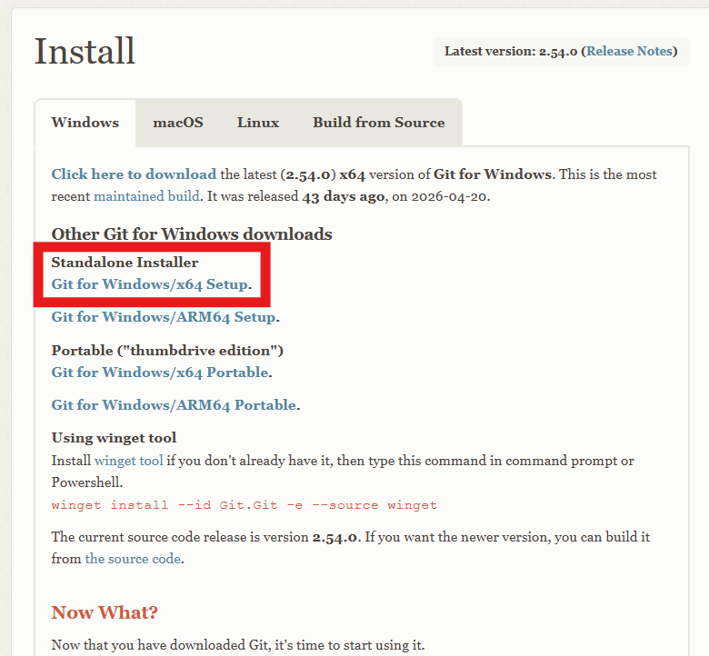
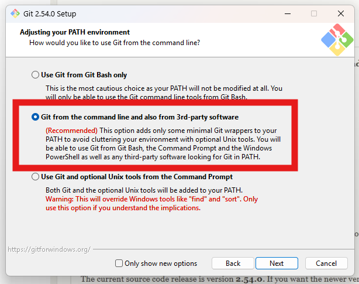
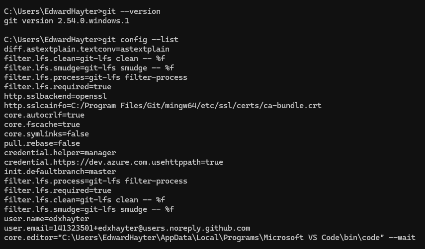
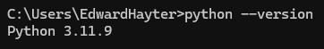
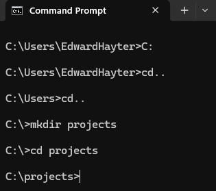
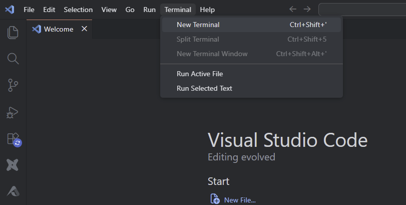
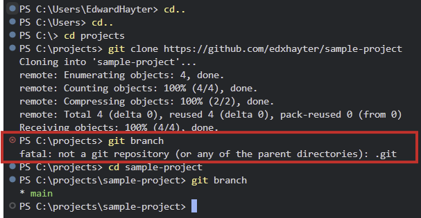
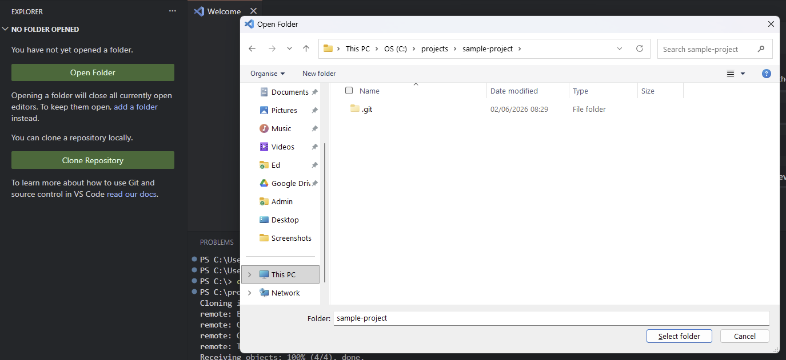
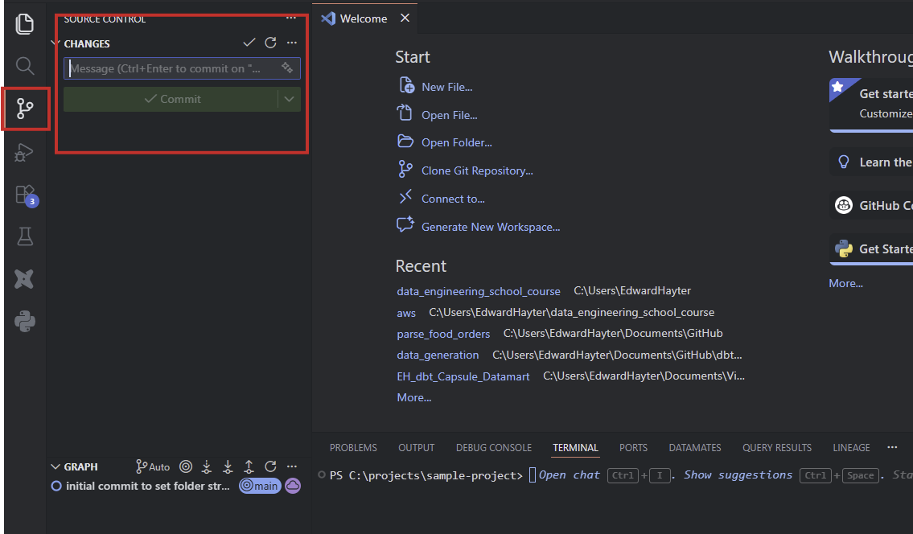

# Want to build a code-based Data Pipeline but not sure where to Start?

I have assumed Windows as the operating system (OS) for this guide.

## Install the software that you will need:

1. Install git to your machine if you have not already - this software tracks changes to files and allows you to version your work.
    1. Git for Windows installer 
        
        
        
    2. Click through the installation steps in the wizard. Keep an eye out to select the step that adds git to PATH:
        
        
        
    3. Its best practice to add Git to your PATH environment variable so that you can use it in any terminal
    4. Open a powershell terminal and check that git works as expected with the command `git --version` If this fails we need to update the PATH variable manually:
        - Windows search ‘Environment Variables’
            1. Open Environment Variables and find the path variable in the system variables, click edit, then new and add these paths:
                1. `C:\Program Files\Git\bin` 
                2. `C:\Program Files\Git\cmd` 
            
            !image.png
            
    5. In powershell set some global git variables that will be tied to your actions
        
        ```powershell
        git config --global user.name "Your Name"
        git config --global user.email "your.email@example.com"
        ```
        
        
        
2. Install python - this guide specifically assumes you will use python as the primary language.
    1. https://www.python.org/downloads/ - pick a python version that is not end of life - 3.12 is a sensible version and we want 64-bit
    2. Follow the steps in the installation wizard. Here we have the option in the wizard to add the python version to the PATH variable from within the wizard
        1. This will allow us to call python by just typing python rather than needing the full exact path to the .exe file
    3. In powershell - check everything is ok with a `python --version` command.
        
        
        
3. Lets make a folder for all our local code:
    1. In powershell navigate to the root of the C Drive and make a directory (I am navigating up to parent folders with `cd ..` as by default it loads in my user space).
        
        
        
    2. This will be a useful place to store all my future projects on my local machine.
4. Make a GitHub account. Store your code in GitHub so that others can see it and so you have a backup in case your local computer stops working.
    1. https://github.com/signup
    2. Create a new repository for your project (alternatively you could publish your local repository but the syntax is easier when you clone a repository down to your local machine so we will do it this way round).
        1. https://github.com/<GitHubUsername>?tab=repositories > Blue New button in the top right, name it after your project (I’d recommend lowercase and using dashes where spaces would be e.g. `sample-project` ). Do not add a `.gitignore` or `readme` as we want to create an empty repo.
5. Install an Integrated Development Environment (IDE) - make your life easier installing a tool like Visual Studio Code (VS Code) rather than trying to work in notepad!
    1. It brings your text editing, terminal and file explorer all in one place: https://code.visualstudio.com/download
    2. Install the GitHub extension for your VSCode: https://marketplace.visualstudio.com/items?itemName=GitHub.vscode-pull-request-github
    3. Check your sidebar for the extension - follow the steps to sign in.

## Pre-requisites complete now lets get the IDE ready for development.

1. In the top bar click Terminal > New Terminal (for us to run our commands). By default VS Code loads a powershell terminal (like we were previously using).
    
    
    
2. I like to do as many of the steps in the terminal - getting familiar with working in terminal is a useful future skill!
    
    
    
    *I’ve highlighted a mistake I made - I needed to navigate to the new folder that was cloned onto my local machine before git recognises I am working in a repository.*
    
    Going through the terminal will not open the directory in your VS Code Workspace (whereas the UI approach will). I loaded up the cloned repo by opening folder and navigating to the location I cloned it to.
    
    
    
- If you want the UI approach (expand here)
    
    In the explorer tab (first option on the left hand banner) click the top option and then the Clone Repository button (cloning the empty GitHub Repo we made onto our local machine).
    
    1. Search for the repository in the search bar if required and then select it and pick its local destination (Navigate to the folder you created to hold all python projects).
1. Now we are ready to work on the repository itself - we can see which Git Branch we are working on by typing `git branch` into the terminal, alternatively it might show in the bottom left corner of the UI.
2. Lets add some sub directories aligned to python best practice, a `.gitignore` file to make sure that we are only sending things we are comfortable being in public to GitHub, and finally a virtual environment (which I will explain next)
3. In the explorer pane right click and add a file called `.gitignore` . In that file add (for the moment):
    
    ```
    .env
    venv/
    data/
    
    ```
    
    Remember to add anything else here you don’t want git to track. I will likely use the .env file to store credentials locally and the virtual environment to run the code will be stored in a `venv/` subdirectory so I have added that as well. If I temporarily store the data locally I will do so in the data subdirectory and I don’t want to put those files on GitHub.
    
    Next I make a requirements.txt to track packages I install for this project.
    
4. Next we need to make some subdirectories - the below is the structure I like:
    
    
    | Sub Directory | Purpose |
    | --- | --- |
    | src | For the actual code |
    | docs | Supporting documentation or images for documentation |
    | data | Storing any data locally while the script processes |
    | tests | Writing any unit tests on my functions or main code - does the code do what is expected when provided with mock inputs |
5. Make the virtual environment - different projects might need different packages or different versions of packages and without proper isolation your projects might break each other.
    
    ```powershell
    python -m venv venv
    # the above creates a virtual environment at the root of your terminal instance - so make sure you are in your project directory
    .\venv\Scripts\Activate
    # the above activates the virtual environment so in terminal you should see an indicator (the green (venv) prefix) that the environment is activated
    deactivate
    # the above deactivates a virtual environment so you can activate a different one if necessary.
    
        
    ```
    
    The first time you try to activate, PowerShell may refuse with an error like `"...Activate.ps1 cannot be loaded because running scripts is disabled on this system."` This is PowerShell's execution policy doing its job - by default it blocks scripts from running. Allow locally-created scripts to run for your user account with:
    
    ```powershell
    Set-ExecutionPolicy -Scope CurrentUser -ExecutionPolicy RemoteSigned
    ```
    
    `RemoteSigned` is a sensible balance: scripts you write locally (like the venv activator) are allowed to run, while scripts downloaded from the internet must be signed by a trusted publisher. Answer `Y` when prompted, then run the `.\venv\Scripts\Activate` command again. If you'd rather not change the setting permanently, use `-Scope Process` instead - that only lifts the restriction for the current terminal window and resets when you close it (so you'd repeat it each session).
    
6. You are ready to commit this code to GitHub. This is the last time I would recommend committing directly to the Main branch (in enterprise settings this will likely be blocked entirely).
    
    ```powershell
    # interactively stage files in the terminal with the below
    git add -i
    # commit those staged files - select the untracked files (4) then select the range of files 1-2 and press enter
    git commit -m "Initial commit to add some project level files"
    # push the update to the remote version of the main branch (origin/main)
    git push
    ```
    
    Note that empty directories are not pushed so only the files have gone to the repo so far.
    
    These steps can be taken with the source control menu within VS Code if you don’t want to take the steps in the terminal.
    
    
    
    1. Lets do a whistle stop tour of branch based development now.